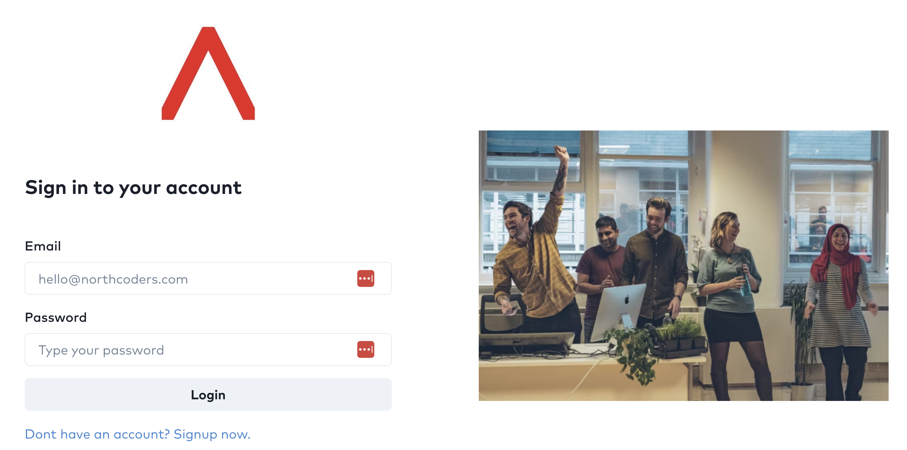

# Head In The Clouds - Built By Alex, Jawad, Kay & Valeria

This is a project that we have built to show our understanding of the technologies we have learnt throughout this bootcamp, connecting a frontend application built in React JS, to a backend application built in Java. The technologies include AWS, Terraform, Docker, Kubernetes, Helm, Jenkins and Grafana.

### Frontend Technologies:

- HTML
- CSS
- [Vite](https://vitejs.dev/)
- [React](https://react.dev/)

#### Frontend Repository:

[https://github.com/northcoders/ce-team-project-frontend](https://github.com/northcoders/ce-team-project-frontend)

### Backend Technologies:

- Java
- [Maven](https://maven.apache.org/)
- [Spring Boot](https://spring.io/projects/spring-boot)
- Spring Actuator
- Spring JDBC For Database Access

#### Backend Repository:

[https://github.com/northcoders/ce-team-project-backend](https://github.com/northcoders/ce-team-project-backend)

## 📈 Objectives

- Your primary objective, as a team, is to get the applications and supporting services deployed to AWS cloud.
- You should make sure to utilse the various topics that have been covered during the programme.
- Also be considerate of the DevOps values - flow, feedback and continual learning. When making decisions, try to document which principle(s) of DevOps are impacted by those decisions.

## 🏆 Minimum Viable Product

- All infrastructure/services you make should be created with infrastructure as code.
- Frontend being built, tested and packaged in an automated CI fashion.
- Backend being built, tested and packaged in an automated CI fashion.
- An automated way of deploying the frontend in either a continuous delivery or continuous deployment fashion.
- An automated way of deploying the backend in either a continuous delivery or continuous deployment fashion.
- A clear, well documented README that guides a reader through the steps required re-create the environment:
  - You can assume the reader has an AWS account.
  - You can assume the reader has all the required software installed locally such as Terraform, Kubernetes, kubectl, Helm etc.
- A presentation (using whichever presentation tool you wish) that shares:
  - Your ways of working such as how you distributed the work, who took up which responsibilities.
  - Tooling used and why you chose that tool (it was taught on the programme is not a valid reason).
  - A visual overview of the architecture and tools you have utilised.
  - Any code examples you wish to share.
  - Challenges you experienced and how you overcame them.
  - The presentation should last around 5 to 6 mins.

## 🤔 Stretch Goals

- The applications don't currently have much logging in them. Adding logging and attempting to centralise the logs could be a good stretch goal. Something that has not yet been covered on the programme.
